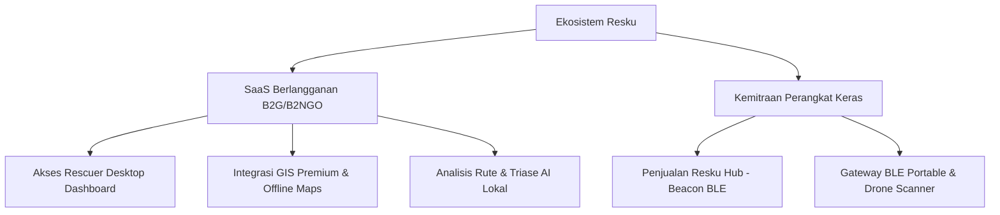

r

# Business Requirements Document (BRD) - Resku

## 1. Pendahuluan & Ringkasan Eksekutif

Resku adalah platform komunikasi tanggap darurat berbasis *offline-first* yang dirancang untuk memulihkan konektivitas komunikasi di wilayah bencana di mana infrastruktur telekomunikasi, internet, dan daya listrik mengalami kerusakan total. Dokumen ini mendefinisikan kebutuhan bisnis, model operasional, strategi monetisasi, proyeksi keuangan, serta metrik keberhasilan untuk memastikan keberlanjutan operasional dan komersial dari proyek Resku di sektor keselamatan publik dan bantuan kemanusiaan.

---

## 2. Masalah & Dorongan Bisnis (Business Drivers)

Saat bencana alam terjadi (seperti gempa bumi, tsunami, banjir bandang, atau tanah longsor), infrastruktur seluler (BTS) seringkali runtuh atau mengalami pemadaman listrik. Hal ini mengakibatkan:

1. **Kegagalan Koordinasi Penyelamatan**: Tim penolong (*Rescuers*) kesulitan memetakan lokasi dan kondisi kesehatan korban (*Survivors*) secara *real-time*.
2. **Keterbatasan Informasi Korban**: Korban tidak dapat mengirimkan sinyal darurat atau status medis mereka tanpa sinyal internet/seluler.
3. **Penyebaran Hoaks & Kepanikan**: Tidak adanya saluran informasi resmi yang andal di daerah terdampak mempersulit evakuasi yang tertib.

Resku menjawab tantangan ini dengan mengubah setiap *smartphone* menjadi node perantara dalam jaringan mesh *Bluetooth Low Energy* (BLE) yang berjalan secara mandiri tanpa internet (*zero-infrastructure*).

---

## 3. Analisis Pasar (Market Analysis)

### 3.1. Target Pasar (Target Market)

Segmen pasar dan pengguna utama Resku dibagi menjadi dua kategori:

- **Pembeli Utama (B2G & B2NGO)**:
  - *Badan Penanggulangan Bencana Pemerintah*: Lembaga penanggulangan bencana nasional dan daerah (misalnya BNPB, BPBD di Indonesia, FEMA di Amerika Serikat) yang membutuhkan dasbor komando terintegrasi untuk mengoordinasikan operasi penyelamatan skala besar.
  - *Organisasi Penyelamat & Kemanusiaan Internasional*: Organisasi non-pemerintah (seperti Palang Merah/Red Cross, PBB/UNOCHA, USAID) yang memimpin upaya bantuan medis dan logistik di daerah terpencil atau terdampak bencana.
- **Komunitas & Pengguna Grassroots (Aplikasi Gratis)**:
  - *Komunitas Relawan Lokal*: Kelompok penolong swadaya masyarakat yang bergerak cepat di garis depan.
  - *Pencinta Alam & Komunitas Radio Amatir*: Pengguna aktif teknologi komunikasi alternatif (seperti pegiat radio komunikasi, *mesh networks*, atau Meshtastic) yang memerlukan alat bantu penjelajahan aman.
  - *Masyarakat Umum (Korban Bencana)*: Warga di daerah rawan bencana yang menggunakan aplikasi secara gratis untuk melapor dan menerima petunjuk evakuasi.

### 3.2. Ukuran Pasar (Market Size - TAM, SAM, SOM)

Potensi komersialisasi platform dihitung berdasarkan alokasi anggaran tanggap darurat dan teknologi mitigasi bencana:

- **TAM (Total Addressable Market) - USD 48.2 Miliar**: Proyeksi ukuran pasar global untuk teknologi manajemen tanggap darurat, keselamatan publik, dan sistem komunikasi penyelamatan bencana.
- **SAM (Serviceable Addressable Market) - USD 1.8 Miliar**: Anggaran pengadaan sistem penanggulangan bencana, navigasi darurat, dan komunikasi mitigasi di kawasan Asia Tenggara (fokus wilayah rentan sabuk api/ring of fire).
- **SOM (Serviceable Obtainable Market) - USD 45 Juta (Rp 700 Miliar)**: Estimasi anggaran alokasi pengadaan software mitigasi dan penunjang darurat oleh BNPB, BASARNAS, dan BPBD di tingkat provinsi rawan bencana di Indonesia (seperti Yogyakarta, Bali, Sumatera Barat, dan Sulawesi Tengah).

---

## 4. Model Bisnis & Monetisasi (Business Model & Monetization)

Untuk menjaga keberlanjutan finansial, pengembangan riset, dan pemeliharaan platform, Resku menerapkan model hibrida yang menggabungkan perangkat keras fisik dan langganan perangkat lunak tingkat korporasi/pemerintah:

### 4.1. SaaS Berlangganan (B2G/B2NGO Subscription)

Pemerintah dan NGO membayar biaya lisensi tahunan untuk mengakses ekosistem komando Resku:

- **Rescuer Desktop/Web Dashboard**: Dashboard pusat komando untuk memantau data agregat dari lapangan secara offline.
- **Local AI Decision Support System (DSS)**: Asisten cerdas pembuat keputusan tim SAR yang berjalan 100% lokal/offline. Menggunakan model bahasa kecil yang dioptimasi (*Quantized Small Language Model* / SLM seperti Llama-3.2-1B terkuantisasi atau Gemma-2B terkompresi) agar dapat dijalankan dengan cepat pada laptop berspesifikasi standar (Intel i5, tanpa kartu grafis/GPU eksternal). AI ini otomatis mengolah data spasial lokal untuk memotong birokrasi dan waktu perencanaan taktis tim SAR:
  1. *Analisis Kepadatan Penduduk*: Mengidentifikasi apakah koordinat pusat gempa berada di wilayah pemukiman ramai/padat penduduk (risiko korban tinggi) atau wilayah terpencil/sepi.
  2. *Perencanaan Logistik & Material*: Menentukan daftar bahan penyelamatan yang harus disiapkan (misal: jumlah tenda medis, kapasitas genset, kantong mayat, air bersih, alat pemotong puing).
  3. *Estimasi Biaya Operasional*: Menghitung proyeksi anggaran biaya darurat (RAB armada penyelamat, ransum relawan, penanganan darurat awal).
  4. *Analisis Medan & Tindakan Taktis*: Mengevaluasi karakteristik medan (pegunungan rawan longsor, dataran banjir, pemukiman padat perkotaan) dan langsung menyusun SOP tindakan taktis tim SAR di menit pertama bencana.
- **Offline Maps & GIS Integrations**: Lisensi untuk mengimpor dan memperbarui peta GIS lokal secara offline (integrasi ArcGIS/QGIS) guna mendukung navigasi tim evakuasi tanpa internet.

### 4.2. Kemitraan Perangkat Keras (Hardware Partnership)

Menyediakan perangkat fisik terintegrasi untuk meningkatkan jangkauan mesh BLE di lapangan:

- **Resku Hub (BLE Beacon)**: Alat pemancar BLE bertenaga baterai tangguh (ruggedized) atau panel surya mini yang diletakkan di titik-titik evakuasi untuk bertindak sebagai *router mesh* statis. Memiliki daya tembus sinyal melalui reruntuhan bangunan dengan radius 10 meter, mencakup volume ruang pencarian bencana sebesar **±4.000 m³ (meter kubik)** per beacon.
- **Drone BLE Scanner**: Modul pemindai BLE yang dipasang pada drone penyelamat untuk terbang di atas area bencana dan mengumpulkan data mesh dari korban secara pasif (*data mule*).

---

## 5. Proyeksi Finansial & Struktur Biaya (Financial Plan)

### 5.1. Segmen B2G (Pemerintah)

- **Harga Paket Penjualan**: **Rp 45.000.000** per wilayah Kabupaten/Kota.
  - *Paket Termasuk*: Lisensi Dashboard 1 tahun + 20 unit Resku Hub Beacons + Pelatihan Lapangan Bersertifikat untuk Relawan Lokal.
- **Harga Pokok Penjualan (HPP) / COGS**: **Rp 25.000.000**
  - Produksi Beacon (20 unit x Rp 350.000) = Rp 7.000.000
  - Biaya Operasional Pelatihan & Logistik Lapangan = Rp 8.000.000
  - Lisensi Server & Paket Data GIS Spasial Offline = Rp 10.000.000
- **Gross Profit Margin**: **44.4%** (Margin Kotor: Rp 20.000.000)
- **Pendekatan Penetrasi**: Melalui mekanisme penunjukan langsung untuk kebutuhan darurat bencana atau pendaftaran produk di E-Katalog LKPP agar dapat dibeli langsung oleh BPBD Kabupaten/Kota menggunakan APBD.

### 5.2. Segmen B2NGO (Non-Governmental Organization)

- **Harga Paket Penjualan**: **Rp 27.500.000** per unit divisi tanggap darurat bencana.
  - *Paket Termasuk*: Lisensi Dashboard 1 tahun + 10 unit Resku Hub Beacons + 2 Unit Smartphone Ruggedized Collector.
- **Harga Pokok Penjualan (HPP) / COGS**: **Rp 15.000.000**
  - Produksi Beacon (10 unit x Rp 350.000) = Rp 3.500.000
  - 2 Unit Smartphone Ruggedized dengan software Collector terpasang = Rp 4.000.000
  - Biaya Setup, Instalasi & Pengiriman Lapangan = Rp 7.500.000
- **Gross Profit Margin**: **45.5%** (Margin Kotor: Rp 12.500.000)
- **Pendekatan Penetrasi**: Mengajukan proposal program mitigasi bencana dan perlindungan warga melalui dana hibah donor kemanusiaan internasional (World Bank, Red Cross, USAID, JICA). Keuntungan segmen ini digunakan untuk mensubsidi silang ketersediaan aplikasi survivor gratis bagi masyarakat sipil.

### 5.3. Studi Kasus Implementasi: Provinsi DKI Jakarta

Sebagai acuan implementasi berskala megacity, berikut adalah proyeksi kebutuhan dan analisis efisiensi biaya untuk memantau titik evakuasi kritis di seluruh wilayah DKI Jakarta:

- **Analisis Kebutuhan Jangkauan**:
  - DKI Jakarta terbagi menjadi **267 Kelurahan**.
  - Menggunakan standar penempatan **3 unit Resku Hub Beacon per Kelurahan** (diletakkan di titik kumpul utama seperti taman kelurahan, ruko evakuasi, dan kantor kelurahan), total kebutuhan adalah **800 unit beacon** untuk seluruh DKI Jakarta.
  - **Volume Jangkauan Reruntuhan**: 800 unit x ±4.000 m³ = **3.200.000 m³ (meter kubik)** volume reruntuhan gedung yang terproteksi jangkauan sinyal tembus beton.
  - **Area Jangkauan Terbuka (Line-of-Sight)**: 800 unit x 31.416 m² (radius 100m) = **25.132.800 m² (25,1 km²)** area titik kumpul evakuasi kritis yang ter-cover jaringan mesh BLE.
- **Perbandingan Nilai Proyek (Harga Lama vs Harga Baru)**:
  - *Skema Harga Lama (HPP Beacon Rp 1.500.000, Paket B2G Rp 195.000.000 / 20 beacon)*:
    - Total Nilai Proyek Jakarta: 40 Paket x Rp 195.000.000 = **Rp 7.800.000.000 (7,8 Miliar Rupiah)**.
  - *Skema Harga Baru (HPP Beacon Rp 350.000, Paket B2G Rp 45.000.000 / 20 beacon)*:
    - Total Nilai Proyek Jakarta: 40 Paket x Rp 45.000.000 = **Rp 1.800.000.000 (1,8 Miliar Rupiah)**.
- **Keunggulan Kompetitif & Efisiensi Anggaran**:
  - Pemerintah Provinsi DKI Jakarta menghemat anggaran sebesar **Rp 6.000.000.000 (6 Miliar Rupiah)** atau menghemat sebesar **77%**.
  - Nilai proyek baru sebesar Rp 1,8 Miliar ini dapat dipecah per Kota Administrasi di bawah Rp 500 Juta (misalnya Jakarta Selatan dengan 65 kelurahan hanya membutuhkan Rp 438 Juta), memungkinkan mekanisme pengadaan langsung atau penunjukan darurat cepat tanpa tender APBD berbulan-bulan.

---

## 6. Analisis Kompetitif & Keunggulan Utama

### 6.1. Matriks Perbandingan Kompetitor

Berikut adalah perbandingan posisi strategis Resku terhadap alternatif solusi komunikasi darurat di pasar:

| Fitur / Kategori               | Resku Mesh (Smartphone)                       | Meshtastic (LoRa)         | Garmin InReach (Satelit)  | Apple Emergency SOS         |
| ------------------------------ | --------------------------------------------- | ------------------------- | ------------------------- | --------------------------- |
| **Biaya Alat Pengguna**  | **Rp 0 (Memakai HP Korban)**            | Rp 800.000 - Rp 1.500.000 | Rp 6.500.000+ per unit    | Hanya di HP Flagship baru   |
| **Biaya Berlangganan**   | **Gratis Selamanya (Survivor)**         | Gratis (Open Source)      | Bulanan ($15 - $60)       | Terbatas masa promo         |
| **Skalabilitas Mesh**    | **Sangat Tinggi (P2P Mesh)**            | Sedang (Bandwidth sempit) | Rendah (Point-to-Point)   | Sangat Rendah (SMS Tunggal) |
| **AI Triage Penyelamat** | **Ada (Lokal Heuristik & SLM Offline)** | Tidak Ada                 | Tidak Ada                 | Tidak Ada                   |
| **Penyebaran Berita**    | **Ada (Pusat ke Seluruh Mesh)**         | Hanya obrolan komunitas   | Hanya komunikasi personal | Hanya ke nomor darurat      |

### 6.2. Keunggulan Utama (Unique Value Proposition - UVP)

1. **Zero-Hardware Barrier for Survivors**: Korban bencana tidak perlu membeli perangkat keras tambahan. Cukup mengunduh aplikasi di smartphone mereka yang mendukung BLE untuk langsung bergabung dalam jaringan mesh.
2. **Local AI Decision Support**: Dashboard komando menggunakan asisten cerdas yang berjalan lokal pada laptop standar tanpa memerlukan spesifikasi tinggi untuk menganalisis kepadatan wilayah, rekomendasi bahan logistik, kalkulasi anggaran biaya, dan analisis medan taktis tim SAR di menit-menit awal.
3. **Passive Data Mule Propagation**: Pengumpulan data dapat dilakukan secara aman dan cepat melalui pergerakan petugas lapangan atau drone penjelajah tanpa mengharuskan korban mendekati pusat komando.
4. **Cost-Efficiency**: Implementasi sistem jauh lebih murah dan cepat dideploy dibandingkan jaringan komunikasi satelit khusus atau infrastruktur radio berdaya tinggi.

---

## 7. Kebutuhan Kunci Produk (Key Product Requirements)

### 7.1. Persyaratan Fungsional

- **Survivor App**: Input status kondisi kesehatan (Triage: Aman, Cedera Ringan, Kritis), kebutuhan logistik (makanan, air, obat-obatan), panduan pertolongan pertama offline (Markdown), dan penerimaan pengumuman resmi.
- **Collector App**: Pengumpulan database mesh secara otomatis saat berdekatan dengan korban, pembentukan Wi-Fi Hotspot lokal untuk menyinkronkan data ke Dashboard pusat komando.
- **Rescuer Dashboard**: Visualisasi koordinat korban pada peta offline, pengurutan daftar prioritas korban, pembuatan pengumuman evakuasi baru, dan integrasi AI Lokal.

### 7.2. Persyaratan Keamanan & Privasi

- **Autentikasi Pengumuman**: Pengumuman evakuasi wajib ditandatangani secara kriptografis (*cryptographic signatures*) oleh pusat komando sebelum disebarkan ke jaringan mesh untuk mencegah kepanikan massal akibat hoaks.
- **Privasi Data Korban**: Enkripsi data identitas dan koordinat korban selama proses transit di jaringan mesh. Data hanya dapat didekripsi oleh tim penyelamat resmi yang terverifikasi.
- **Kepatuhan Hukum (GDPR/PDPA)**: Penghapusan otomatis (*auto-purging*) terhadap rekaman data korban dari pangkalan data lokal setelah masa tanggap darurat bencana selesai atau ketika status korban telah ditandai sebagai "Telah Dievakuasi".

---

## 8. Strategi Go-To-Market (GTM) & Rencana Masa Depan

### 8.1. Peta Jalan Pengembangan (Roadmap 2026)

- **Fase 1: R&D & Pengujian Daya (Q1-Q2 2026)**: Optimalisasi interval role-switching BLE pada berbagai variasi jenis sistem operasi (iOS/Android), integrasi Protobuf untuk kompresi payload, dan sertifikasi algoritma keamanan pengumuman.
- **Fase 2: Proyek Pilot (Q3 2026)**: Uji coba lapangan dengan menempatkan 20 unit Resku Hub Beacon di jalur evakuasi Merapi, bekerjasama dengan BPBD D.I. Yogyakarta dan relawan kebencanaan setempat.
- **Fase 3: Komersialisasi & LKPP (Q4 2026)**: Pendaftaran resmi pada katalog elektronik LKPP Indonesia, ekspansi kemitraan ke tingkat nasional bersama BASARNAS pusat, serta sertifikasi firmware modul drone.

### 8.2. Dampak Target Akhir 2026 (Impact 2026)

- **Sosial**: Target penyebaran 100.000+ aplikasi survivor terpasang di wilayah rentan cincin api. Mengurangi rata-rata waktu respons pencarian korban kritis hingga **35%**.
- **Bisnis**: Mencapai Pendapatan Berulang Tahunan (ARR) sebesar **USD 1.2 Juta (Rp 18.5 Miliar)** dengan penyebaran 30+ titik Command Center BPBD Daerah.

### 8.3. Strategi Keluar (Exit Strategy)

1. **Initial Public Offering (IPO)**: Penawaran umum perdana saham di Bursa Efek Indonesia (BEI) untuk memperkuat permodalan, memperluas jangkauan infrastruktur mesh nasional, serta memberikan exit value likuid bagi investor awal dan tim pendiri.
2. **Kemitraan BUMN Penyelenggara Keamanan**: Transisi spin-off produk di bawah naungan BUMN teknologi pertahanan dan komunikasi kritis nasional (seperti PT Len Industri) untuk keberlanjutan pemeliharaan oleh negara.
3. **Ekspansi Komersial B2B**: Lisensi software mesh dilisensikan untuk kebutuhan pemantauan keselamatan pekerja di industri berisiko tinggi tanpa internet (seperti pertambangan bawah tanah dan kehutanan terpencil).

---

## 9. Metrik Keberhasilan (Key Performance Indicators - KPIs)

Keberhasilan implementasi Resku diukur melalui metrik operasional dan bisnis berikut:

| Kategori Metrik                | KPI Utama                                     | Target Operasional                                                                                     |
| ------------------------------ | --------------------------------------------- | ------------------------------------------------------------------------------------------------------ |
| **Dampak Operasional**   | Penurunan Waktu Evakuasi (*Time-to-Rescue*) | Mengurangi waktu pencarian korban kritis hingga 40% dibanding metode manual.                           |
| **Akurasi Penyelamatan** | Akurasi Triase & Alokasi Sumber Daya          | >95% korban berkondisi kritis ditangani terlebih dahulu oleh tim penolong di lapangan.                 |
| **Keandalan Teknis**     | Efisiensi Konsumsi Baterai                    | Aplikasi Survivor mampu bertahan aktif minimal 72 jam secara konstan dengan mode role-switching BLE.   |
| **Kecepatan Mesh**       | Kecepatan Propagasi Data                      | Pengumuman darurat tersebar ke 80% node mesh aktif dalam radius 1 km dalam waktu kurang dari 30 menit. |
