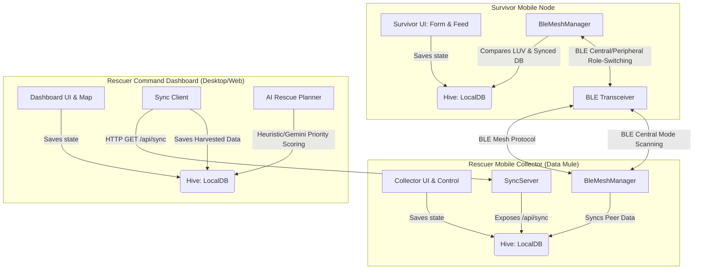
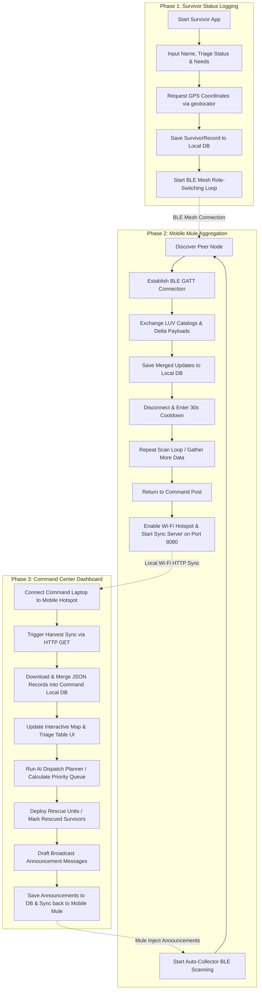

# Application Architecture & End-to-End Operational Flow (Resku)

This document provides a technical walkthrough of **Resku**, explaining how its modules interact and providing a step-by-step guide for each role.

---

## 1. System Architecture & Module Interactions

Resku is designed as an offline-first ad-hoc emergency communication system. When primary network infrastructure (cellular tower, internet, power grid) fails, standard consumer smartphones running Resku form a delay-tolerant ad-hoc mesh network via Bluetooth Low Energy (BLE).

The system architecture consists of three principal layers: the **Storage Layer**, the **Networking Layer**, and the **User Interface Layer**.

### 1.1 Storage Layer
- **[local_db.dart](file:///d:/dev/resku/lib/core/database/local_db.dart) (`LocalDB`)**: A singleton database service based on the Hive NoSQL framework. It manages two main document boxes:
  - `survivor_records_box`: Stores serialized [SurvivorRecord](file:///d:/dev/resku/lib/core/models/survivor_record.dart) maps indexing coordinates, health status, and resource needs.
  - `rescuer_messages_box`: Stores serialized [RescuerMessage](file:///d:/dev/resku/lib/core/models/rescuer_message.dart) maps representing news and directives broadcasted from command centers.
- **Stable UUID Generation**: Auto-generates a persistent device identifier (e.g., `survivor_1721112345_abcd` or `rescuer_1721112345_efgh`) stored securely in Hive to prevent duplicates.
- **Auto-Pruner**: Automatically purges database logs where the timestamp is older than 72 hours (3 days) to protect local storage capacity.

### 1.2 Networking Layer
- **[ble_mesh_manager.dart](file:///d:/dev/resku/lib/core/network/ble/ble_mesh_manager.dart) (`BleMeshManager`)**: Orchestrates the ad-hoc mesh networking using a time-sliced central/peripheral cycle:
  - **Broadcasting (Peripheral)**: Advertises `serviceUuid` (`8f7b3e0c-d3a9-4672-9b2f-7a4c6a8b79d2`) hosting a GATT server with `charUuid` (`a3f5b2c9-e7d1-42a8-9b8f-3c6d4e5f0a1b`).
  - **Receiving (Central)**: Scans for peers running the same `serviceUuid`. Upon discovery, it stops scanning, establishes a GATT connection, coordinates the handshake, and disconnects.
  - **Interval Adjustment & Battery Saver**: Normal cycle uses 8s advertising, 4s scanning, and 30s cooldown. If battery levels drop below 20%, it adapts to 4s advertising, 2s scanning, and 90s cooldown.
- **[epidemic_sync.dart](file:///d:/dev/resku/lib/core/network/dtn/epidemic_sync.dart) (`EpidemicSync`)**: Coordinates Delay-Tolerant Networking (DTN) Epidemic Routing:
  1. **Step 1: Catalog Exchange**: The central node reads the peripheral's Latest Update Vector (LUV) catalog (an index mapping IDs to sequence numbers).
  2. **Step 2: Delta Compilation & Upload**: The central node compares the peer LUV to its own database. It compiles and writes a JSON payload containing its own LUV and a delta payload (any local survivor logs or messages that are newer/missing on the peer side). The peripheral receives the write and saves the delta records.
  3. **Step 3: Return Delta Download**: The peripheral compiles a return delta (records on the peripheral that are newer than the central LUV) and saves it to a temporary variable. The central node reads this characteristic, downloads the return delta, saves it locally, and completes the sync.
- **[sync_server.dart](file:///d:/dev/resku/lib/core/network/server/sync_server.dart) (`SyncServer`)**: Runs a Shelf-based HTTP API server on port `8080` when active on a Rescuer Mobile Collector device.
  - Endpoint `/api/sync` handles HTTP requests, returning the complete aggregated list of survivor records in JSON format.

---

## 2. Dynamic Feature Module Integrations

### 2.1 Survivor Module
- **[survivor_form_screen.dart](file:///d:/dev/resku/lib/features/survivor/forms/survivor_form_screen.dart)**:
  - Collects GPS locations via the `geolocator` plugin.
  - Saves updates to [SurvivorRecord](file:///d:/dev/resku/lib/core/models/survivor_record.dart), incrementing `sequenceNumber`.
  - Displays the active BLE mesh state (`searching`, `broadcasting`, `receiving`, `success`, `waiting`) in the status badge.
  - Loops and displays the carousel of rescue announcements received through the mesh.
- **[first_aid_guide_screen.dart](file:///d:/dev/resku/lib/features/survivor/guide/first_aid_guide_screen.dart)**:
  - Displays structured, offline markdown-like first-aid guides organized by urgency indicators (CPR, Bleeding, Fractures, Burns, Heatstroke).
- **[mesh_nodes_screen.dart](file:///d:/dev/resku/lib/features/survivor/nodes/mesh_nodes_screen.dart)**:
  - Displays a database query of all other survivor nodes currently cached in the local device, filterable by triage priority.

### 2.2 Rescuer Mobile Collector Module
- **[collector_screen.dart](file:///d:/dev/resku/lib/features/rescuer/collector/collector_screen.dart)**:
  - Operates as a "Data Mule".
  - Runs in Central Scan-Only Mode, aggressively harvesting records from the survivor nodes it passes by, and injecting command announcements.
  - Hosts the local sync AP Server so that dashboard terminals can download collected logs via local Wi-Fi hotspots.

### 2.3 Rescuer Command Dashboard
- **[dashboard_screen.dart](file:///d:/dev/resku/lib/features/rescuer/dashboard/dashboard_screen.dart)**:
  - **OpenStreetMap Map View** ([osm_map_widget.dart](file:///d:/dev/resku/lib/features/rescuer/dashboard/map/osm_map_widget.dart)): Renders survivors as interactive color-coded markers (Safe: Green, Injured: Orange, Critical: Red).
  - **Triage Lists** ([survivors_table_widget.dart](file:///d:/dev/resku/lib/features/rescuer/dashboard/table/survivors_table_widget.dart)): Filters survivors by status level and request type.
  - **AI Dispatch Planner** ([ai_planner_widget.dart](file:///d:/dev/resku/lib/features/rescuer/dashboard/ai/ai_planner_widget.dart)): Runs online prioritizing prompts through Gemini, or falls back to an offline heuristic engine calculating:
    $$\text{Priority Score} = (\text{Triage Weight} \times 1.5) + \frac{\text{Minutes Elapsed}}{10} - \frac{\text{Distance in km}}{5}$$
  - **Mule Sync Client**: Handshakes with the Mobile Collector over local HTTP hotspots.

---

## 3. Sequential Operational Flow (Step-by-Step Scenario)

### Phase 1: Survivor Status Logging & Mesh Propagation (Survivor Role)
1. Launch the app and select **ENTER SURVIVOR APP** in [main.dart](file:///d:/dev/resku/lib/main.dart).
2. On the **Home** page tab, enter your name, select your medical triage status (Safe, Injured, Critical), check your required needs (Food, Water, Shelter, Medical), and press **BROADCAST STATUS**.
3. The app requests location services permissions, captures the GPS coordinates, creates a [SurvivorRecord](file:///d:/dev/resku/lib/core/models/survivor_record.dart), stores it locally in Hive, and launches the BLE loop.
4. The status bar displays **SEARCHING MESH...** or **BROADCASTING...**. The device is now active as a routing node, ready to propagate its record and listen for peers.

### Phase 2: Mobile Mule Aggregation & Broadcast Injection (Rescuer Collector Role)
1. The field rescuer launches the mobile collector app and selects **ENTER RESCUER DASHBOARD** (detecting mobile OS, it opens the [CollectorScreen](file:///d:/dev/resku/lib/features/rescuer/collector/collector_screen.dart)).
2. Under **AUTO-COLLECTOR**, tap **START COLLECTING**.
3. As the rescuer walks or drives through the disaster-stricken area:
   - The phone scans for survivor nodes.
   - When a peer is found, it handshakes, transfers the survivor's data delta into its own database, and writes any active command center announcements into the survivor's database.
   - The survivor's home page screen flashes **SYNC SUCCESS** and updates the list of active mesh announcements, while the collector screen logs: `Saved survivor record to DB: <uuid>`.
4. When collection is complete, the rescuer returns to the command camp. Under **AP SYNC SERVER**, tap **START SERVER** (which registers the HTTP service at `http://192.168.43.1:8080`).

### Phase 3: Command Center Sync & Rescue Execution (Rescuer Command Role)
1. The commander launches the dashboard on a laptop/desktop (web/desktop environment initiates the [RescuerDashboardScreen](file:///d:/dev/resku/lib/features/rescuer/dashboard/dashboard_screen.dart)).
2. Connect the laptop to the Mobile Collector's Wi-Fi hotspot.
3. Click the **MULE SYNC** button in the dashboard top navigation bar.
4. Verify the server endpoint (`http://192.168.43.1:8080`) in the dialog box, and click **HARVEST SYNC**. The client pulls the database via HTTP and merges the locations.
5. The map updates with colored markers. Clicking a marker shows the survivor's info, needs, and synchronization logs.
6. The AI Recommendation widget ranks the dispatch queue:
   - Click **GENERATE DISPATCH PLAN** to calculate the sequence.
   - The system displays the prioritized list. Click **DEPLOY** next to the highest priority survivor.
   - This sets their status to "Safe" and logs a dispatch event.
7. To broadcast evacuation info back to the mesh, type a notice (e.g., *"Evacuation helicopter landing at Base Camp at 16:00"*) in the **Broadcast Console** and click **SEND**.
8. The announcement is added to the local database, synced back to the Mobile Collector on the next Harvest, and pushed to survivors' devices as collectors move back into the field.
