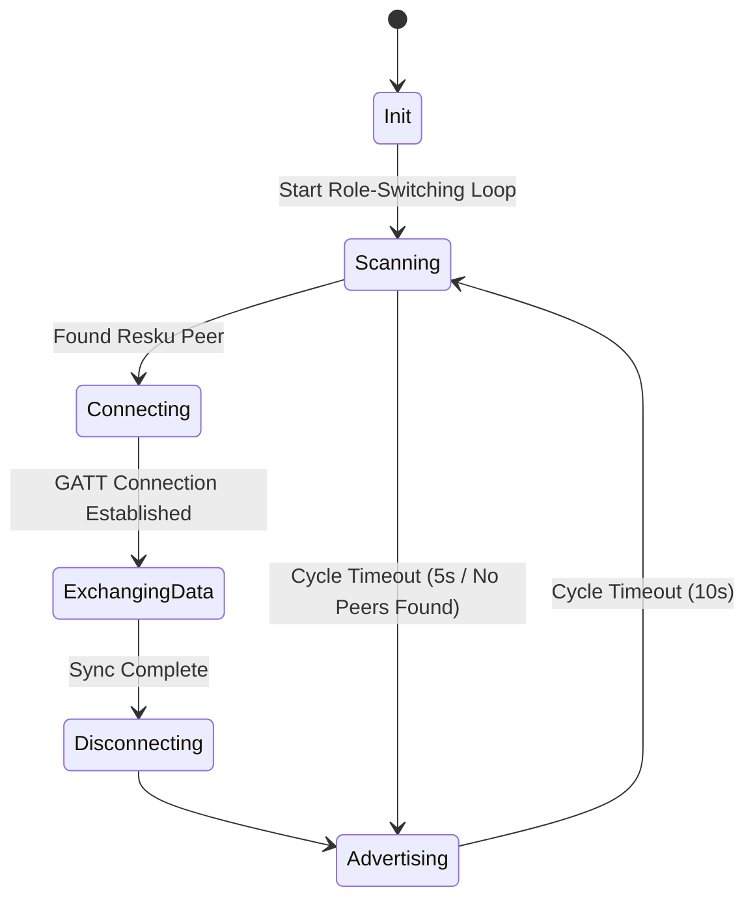

# Product Requirements Document (PRD) - Resku

## 1. Executive Summary & Vision
Resku is an offline-first communication platform designed to coordinate rescue efforts in disaster-stricken areas where cellular networks, internet, and power infrastructure are damaged or unavailable. 

By using standard smartphones, Resku establishes a delay-tolerant ad-hoc mesh network via Bluetooth Low Energy (BLE). Survivor devices act as routing nodes, storing and forwarding location, health, and request data across the mesh. Rescuer mobile devices collector nodes pull this data from the mesh and synchronize it with a central Rescuer Web Dashboard.

This enables rescuers to map survivors, prioritize triage, plan resource distribution, and broadcast status updates back into the mesh network.

---

## 2. Technology Stack & Key Dependencies
- **Core Framework**: Flutter (Dart) for cross-platform mobile and web applications from a single codebase.
- **BLE Management**:
  - `flutter_blue_plus`: Handles BLE Central operations (scanning, connecting to peripherals, pulling data).
  - `ble_peripheral`: Handles BLE Peripheral operations (advertising, hosting GATT services, writing/reading characteristics).
- **Local Database**: `hive` (Fast, lightweight NoSQL key-value store with strong web compatibility).
- **Serialization**: `protobuf` (Protocol Buffers) or MessagePack (MsgPack) to serialize location tables and messages into binary format, fitting within BLE MTU constraints.
- **Mapping (Dashboard)**: `flutter_map` with OpenStreetMap data, utilizing offline tile caching.
- **AI Core**: Gemini API (Online mode) / Local rule-based heuristic scoring engine (Offline mode).

---

## 3. System Architecture & Workflows

### 3.1 Network Architecture: Dynamic Role-Switching
Since consumer smartphones cannot easily run simultaneous Central and Peripheral BLE roles reliably across platforms (iOS/Android), Resku uses a **Time-Sliced Role-Switching Cycle**:
- **Advertising State (Peripheral)** (e.g., 10 seconds): The device advertises a specific Resku Service UUID. It hosts a GATT server containing two primary characteristics: `location_exchange` and `rescuer_announcements`.
- **Scanning State (Central)** (e.g., 5 seconds): The device scans for the Resku Service UUID. If found, it establishes a GATT connection to the peer, exchanges synchronization metadata, pushes updates, pulls updates, and disconnects.



### 3.2 Routing Protocol: Delay-Tolerant Epidemic Routing
Data synchronization between peers uses a timestamp-based Epidemic Routing scheme:
1. **Latest Update Vector (LUV)**: Each node maintains a list of known survivor IDs and their latest message sequence numbers / update timestamps.
2. **Synchronization Handshake**:
   - Upon connection, the Central reads the Peripheral's LUV and sends its own LUV.
   - Each side identifies which records in its local DB are newer than the peer's.
   - Only the delta (modified/new location records or newer rescuer announcements) is transmitted over the BLE connection.
3. **Data Anonymity**: To keep payload sizes minimum, location records are transmitted in plain binary format without digital signatures.

---

## 4. Database Schema
Resku uses a simple, flat NoSQL document schema in Hive to store mesh state.

### 4.1 Survivor Record (`SurvivorRecord`)
Represents the status and location of a survivor node, propagated throughout the mesh.
```json
{
  "id": "String (UUID)",
  "name": "String",
  "latitude": "Double",
  "longitude": "Double",
  "status": "Enum (safe | injured | critical)",
  "needs": "String (e.g., 'water, first aid')",
  "timestamp": "Int64 (Milliseconds since epoch)",
  "sequenceNumber": "Int32"
}
```

### 4.2 Rescuer Broadcast Message (`RescuerMessage`)
Represents messages broadcasted by rescuers (e.g., evacuation locations, arrival times) that propagate down the mesh.
```json
{
  "id": "String (UUID)",
  "message": "String",
  "timestamp": "Int64 (Milliseconds since epoch)"
}
```

---

## 5. Detailed Feature Requirements

### 5.1 Survivor Module (Mobile App)
The survivor module runs on mobile devices and provides a simplified interface for survivors.
1. **Status Input Form**:
   - Fields: Name, Status triage slider (Safe / Injured / Critical), and specific assistance requests (check-boxes for Food, Water, First Aid, Shelter, + text details).
   - Once submitted, it updates the local device's `SurvivorRecord` and increments its `sequenceNumber`.
2. **Mesh Sync Engine**:
   - Runs in the background (within platform limitations) to perform the Central/Peripheral role-switching cycle and replicate data.
3. **First Aid Guide**:
   - Completely offline documentation viewer.
   - Renders structured Markdown files bundled within the app assets.
4. **Rescuer Announcements Feed**:
   - A list displaying all `RescuerMessage` entries received via the mesh, sorted by timestamp.

### 5.2 Rescuer Module (Mobile & Web)

#### 5.2.1 Rescuer Mobile Collector App
Used by field rescuers to gather mesh databases by walking or flying (drones) near survivor zones.
1. **Auto-Collector Mode**:
   - Automatically scans and connects to any survivor node.
   - Syncs the survivor's local mesh DB into the Rescuer Collector database.
   - Automatically pushes active `RescuerMessage` broadcasts to the survivor node.
2. **Local Sync Server**:
   - Can spawn a local web server (HTTP API) over a local Wi-Fi Hotspot.
   - Endpoint: `/api/sync` returns the full list of collected survivor records.

#### 5.2.2 Rescuer Desktop/Web Dashboard
A central UI deployed at the rescue command post (on a laptop/desktop) to coordinate operations.
1. **Local Collector Sync client**:
   - Connects to the Mobile Collector's hotspot IP address and downloads the aggregated DB.
2. **Map View**:
   - Displays all survivors on a map using `flutter_map` (OpenStreetMap).
   - Marker styling: Color-coded by status (Red: Critical, Orange: Injured, Green: Safe).
   - Popups display the survivor name, needs, and timestamp.
3. **Table View**:
   - Sortable lists of all survivors.
   - Quick filters (e.g., "Critical Only", "Needs First Aid").
4. **Broadcast Console**:
   - Input field to draft short news announcements (e.g., "Rescue teams deploying near the North River area at 14:00").
   - These are stored in the local database and synced to Mobile Collectors, which will inject them into the survivor mesh.
5. **AI Rescue Planner**:
   - **Online Mode**: Sends the current list of survivors, statuses, and locations to the Gemini API with a prompt to generate an optimal rescue sequence, route, and load distribution plan.
   - **Offline Fallback**: Uses a local priority scoring algorithm to rank survivors (Triage level weight + time elapsed since update - distance from command center).

---

## 6. Offline Support & Edge Cases

### 6.1 Battery Conservation
Continuous BLE scanning and advertising drains battery. The app should:
- Implement adaptive intervals (e.g., scan less frequently when battery is below 20%).
- Provide a manual "Battery Saver" mode.

### 6.2 Data Expiration & DB Purging
To prevent the Hive storage from growing indefinitely:
- Implement a stale-data pruning routine.
- Delete survivor records where `timestamp` is older than 72 hours, or if marked as "Rescued" by command center message updates.

### 6.3 Bluetooth Range Restrictions
- Bluetooth 5.0 allows range up to 240m in line-of-sight but is significantly lower indoors (~10-20m).
- The mesh relies heavily on high survivor density or "data mules" (people moving around) to bridge distance gaps.
