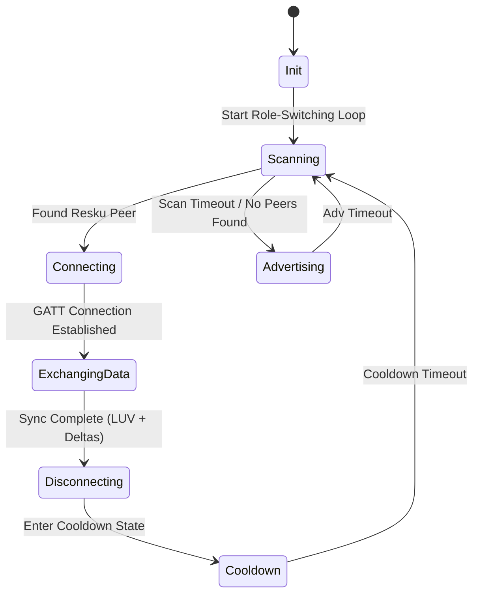

# Product Requirements Document (PRD) - Resku

## 1. Executive Summary & Vision
Resku is an offline-first emergency communication platform designed to coordinate search, rescue, and triage operations in disaster-stricken areas where cellular networks, internet connectivity, and power grids are damaged or entirely unavailable. 

By leveraging standard consumer smartphones, Resku establishes a delay-tolerant ad-hoc mesh network via Bluetooth Low Energy (BLE). Survivor devices operate as routing nodes, storing and propagating location, medical status, and urgent resource request data across the mesh. Rescuer mobile devices (acting as "Data Mule" collector nodes) harvest this aggregated data from the mesh and synchronize it with a central Rescuer Web Dashboard.

This decentralized network topology enables rescue coordinators at the base camp to map survivors, prioritize triage queues, coordinate resource distribution, and broadcast critical announcements back into the active survivor mesh.

---

## 2. Technology Stack & Key Dependencies
- **Core Framework**: Flutter (Dart) for cross-platform mobile and web application development from a single, unified codebase.
- **BLE Management**:
  - `flutter_blue_plus`: Handles BLE Central operations (continuous scanning, connecting to peripherals, and fetching GATT characteristics).
  - `ble_peripheral`: Handles BLE Peripheral operations (advertising services, hosting the GATT server, and managing read/write characteristic callbacks).
- **Local Database**: `hive` and `hive_flutter` (High-performance, lightweight, offline-first NoSQL key-value store with strong web compatibility).
- **Serialization**: JSON string encoding (via Dart's native `jsonEncode` / `jsonDecode` to UTF-8 binary payloads) to serialize location tables, Latest Update Vectors (LUVs), and news announcements over BLE characteristics.
- **Mapping & GIS (Dashboard)**: `flutter_map` with OpenStreetMap (OSM) tile support, utilizing `latlong2` for coordinate mathematics and distance calculations.
- **AI Engine**: A local rule-based heuristic priority scoring engine for offline tactical dispatch planning. *(Note: Future releases will include a Gemini API online mode with fallback configuration parameters defined in system constants).*
- **Local Sync HTTP Server**: `shelf` and `shelf_io` to spawn local hotspot synchronization servers on the mobile collector.
- **Device Status & Permissions**: `battery_plus` for adaptive power mode scaling, `geolocator` for offline GPS coordinate retrieval, and `permission_handler` for managing runtime platform permissions.

---

## 3. System Architecture & Workflows

### 3.1 Network Architecture: Dynamic Role-Switching
Because standard consumer smartphones cannot run simultaneous Central and Peripheral BLE roles reliably across different operating systems (iOS and Android), Resku implements a **Time-Sliced Role-Switching Cycle**:
- **Advertising State (Peripheral Role)**: The device advertises a specific Resku Service UUID (`8f7b3e0c-d3a9-4672-9b2f-7a4c6a8b79d2`). It hosts a GATT server containing a single primary characteristic (`a3f5b2c9-e7d1-42a8-9b8f-3c6d4e5f0a1b`) that handles both read and write requests for data synchronization.
- **Scanning State (Central Role)**: The device actively scans for the Resku Service UUID. Upon discovery, it establishes a GATT connection to the peer, exchanges synchronization metadata, writes local deltas, reads peer deltas, and disconnects.
- **Cycle Timing Intervals**:
  - **Normal Mode**: 8 seconds advertising, 4 seconds scanning, followed by a 30-second cooldown (idle) state.
  - **Battery Saver Mode (Battery < 20%)**: Adaptively scales to 4 seconds advertising, 2 seconds scanning, followed by a 90-second cooldown state.



### 3.2 Routing Protocol: Delay-Tolerant Epidemic Routing
Data synchronization between mesh nodes uses a timestamp and sequence-based Epidemic Routing scheme:
1. **Latest Update Vector (LUV)**: Each node maintains a local database catalog containing known survivor IDs alongside their latest message sequence numbers, as well as known rescuer announcement message IDs and timestamps.
2. **Synchronization Handshake (Single Characteristic)**:
   - Upon connection, the Central node reads the Peripheral's LUV catalog.
   - The Central node compares the peer LUV against its own local database, compiles a combined JSON payload containing its own LUV and any local survivor/message deltas that are newer or missing on the peer, and writes this payload to the Peripheral's characteristic.
   - The Peripheral processes the write request, saves the inbound records to Hive, and compiles a return delta containing local records newer than the Central's LUV.
   - The Central node reads the characteristic again to download the compiled return delta, saves it locally, and terminates the connection.
3. **Data Serialization**: To fit within BLE MTU constraints, locations and announcements are compacted and transmitted as raw JSON strings.

---

## 4. Database Schema
Resku uses a simple, flat NoSQL document schema in Hive to store mesh state.

### 4.1 Survivor Record (`SurvivorRecord`)
Represents the status and location of a survivor node, propagated throughout the mesh.
```json
{
  "id": "String (Stable device UUID: survivor_timestamp_random)",
  "name": "String",
  "latitude": "Double",
  "longitude": "Double",
  "status": "Enum (safe | injured | critical)",
  "needs": "String (e.g., 'Food & Water, First Aid / Medical')",
  "timestamp": "Int64 (Milliseconds since epoch)",
  "sequenceNumber": "Int32"
}
```

### 4.2 Rescuer Broadcast Message (`RescuerMessage`)
Represents messages broadcasted by rescuers (e.g., evacuation locations, arrival times) that propagate down the mesh.
```json
{
  "id": "String (ann-timestamp)",
  "message": "String (Max 160 characters)",
  "timestamp": "Int64 (Milliseconds since epoch)"
}
```

---

## 5. Detailed Feature Requirements

### 5.1 Survivor Module (Mobile App)
The survivor module runs on mobile devices and provides a simplified bottom-navigation interface with three primary views:
1. **Home Screen (Status Input Form & Broadcasts)**:
   - Form Fields: Name input, Triage Status dropdown (Safe / Injured / Critical), and checkboxes for specific resource needs (Food & Water, First Aid / Medical, Shelter, Tools / Warmth).
   - Once submitted, it updates the local device's `SurvivorRecord` (generating or incrementing `sequenceNumber`), fetches GPS coordinates using `geolocator`, and triggers the BLE Mesh cycle.
   - Displays the active BLE mesh state (`Disconnected`, `Searching Mesh...`, `Broadcasting...`, `Receiving...`, `Mesh Connected`, `Sync Success`, `Waiting (Xs)`) in the top status bar.
   - Displays a sliding card carousel at the top showing the latest `RescuerMessage` entries received via the mesh, with a 6-second auto-swipe timer.
2. **First Aid Screen**:
   - Completely offline guide viewer.
   - Renders a custom styled expansion accordion list detailing emergency protocols for CPR, Severe Bleeding, Fractures, Severe Burns, and Heatstroke & Dehydration, complete with urgency colors and warning highlights.
3. **Mesh Nodes Screen**:
   - Displays all other survivor nodes currently cached in the local database.
   - Provides a search bar (filtering name or needs) and triage priority filter pills (All, Critical, Injured, Safe).
   - Shows coordinates, requested needs, sync time, and sequence number for each synced node.

### 5.2 Rescuer Module (Mobile & Web)

#### 5.2.1 Rescuer Mobile Collector App
Used by field rescuers to gather mesh databases by walking or flying (drones) near survivor zones.
1. **Auto-Collector Mode**:
   - Aggressively scans and connects to survivor nodes (ignoring other rescuer devices).
   - Syncs the survivor's local mesh DB into the Rescuer Collector database.
   - Automatically pushes active `RescuerMessage` broadcasts to the survivor node.
2. **Local Sync AP Server**:
   - Spawns a local HTTP API server using `shelf` on port `8080` over a local Wi-Fi Hotspot.
   - Endpoint: `/api/sync` returns the full list of collected survivor records in JSON format.
   - Includes custom CORS middleware to allow cross-origin requests from web dashboards.

#### 5.2.2 Rescuer Desktop/Web Dashboard
A central UI deployed at the rescue command post (on a laptop/desktop) to coordinate operations.
1. **Local Collector Sync Client (Mule Sync)**:
   - Connects to the Mobile Collector's hotspot IP address (default: `http://192.168.43.1:8080`) and downloads/merges the aggregated DB.
2. **Map View**:
   - Displays all survivors on a map using `flutter_map` (OpenStreetMap).
   - Marker styling: Color-coded by status (Red: Critical, Orange: Injured, Green: Safe).
   - Displays concentric tactical rings centered on Base Camp coordinates (`-6.2100`, `106.8475`).
   - Popups show survivor details (needs, last update time, coordinates) and provide a "Deploy Team" action.
3. **Table View**:
   - Sortable database roster of all survivors showing Name, Status badge, Needs, Coordinates, Timestamp, and a "Locate" button.
   - Filter chips for triage status (All, Critical, Injured, Safe).
4. **Broadcast Console**:
   - Input field to draft short news announcements (Max 160 characters).
   - Stores these in Hive, which will sync to Mobile Collectors and propagate down the survivor mesh.
5. **AI Rescue Planner**:
   - Ranks active survivors into an optimal rescue queue using a rule-based Heuristic Engine:
     $$\text{Priority Score} = \text{Status Urgency Points} + \text{Proximity Points} + \text{Wait Time Points}$$
     - **Status Urgency**: Critical = 60 pts, Injured = 35 pts, Safe = 5 pts.
     - **Proximity**: $\frac{25}{1 + \text{Distance in km from Base Camp}}$.
     - **Wait Time**: $0.2 \text{ points per minute elapsed}$, capped at 15 pts (~75 minutes max influence).
     - The total score is clamped/rounded between 0 and 100.
     - Sorted descending (high priority first), filtering out resolved/safe survivors, with distance as a secondary tie-breaker.
   - Clicking **Deploy** next to a survivor dispatches a team, setting their status to Safe and updating needs to `"None (Rescue unit arrived)"`.

---

## 6. Offline Support & Edge Cases

### 6.1 Battery Conservation
Continuous BLE scanning and advertising drains battery. The app implements:
- Battery Saver mode: If battery levels fall below 20%, it adapts the role-switching interval to reduce duty cycle (4s adv, 2s scan, 90s cooldown).

### 6.2 Data Expiration & DB Purging
To prevent local Hive storage from growing indefinitely:
- Auto-pruning pruner: Automatically purges survivor records and announcements older than 72 hours (3 days) on database load.

### 6.3 Bluetooth Range Restrictions
- Bluetooth range varies significantly from up to 240m (line-of-sight) to 10-20m indoors.
- The mesh relies on high survivor density or "data mules" (people moving around) to bridge distance gaps.
