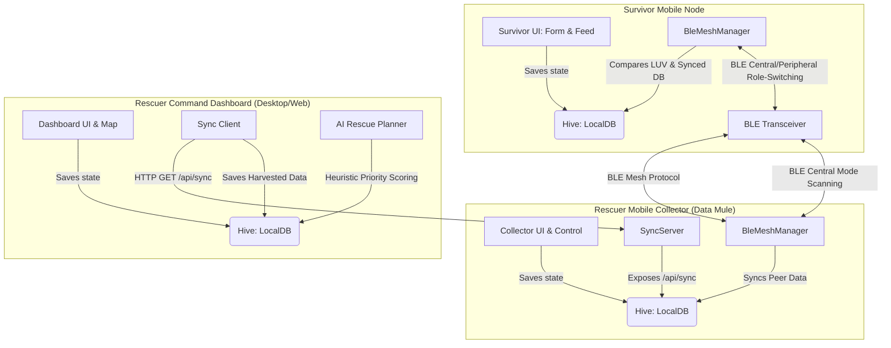
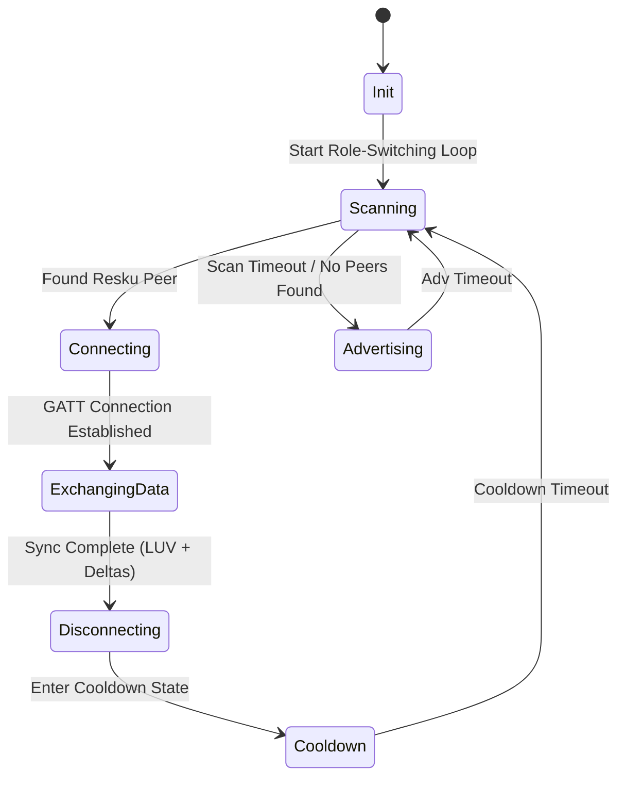

# Resku 🌐🆘

> **Offline-First Emergency Communication & Triage Mesh Network**

[](https://flutter.dev)
[](https://dart.dev)
[](#)
[](#)
[](#)
[](#)

---

## 📖 Table of Contents
- [Project Vision](#-project-vision)
- [System Architecture](#%EF%B8%8F-system-architecture)
- [Core Features](#-core-features)
  - [Survivor App](#1-survivor-app-mobile)
  - [Rescuer Mobile Collector (Data Mule)](#2-rescuer-mobile-collector-data-mule)
  - [Rescuer Command Dashboard](#3-rescuer-command-dashboard-desktop-web)
- [Protocol Specifications](#-protocol-specifications)
  - [Role-Switching Cycle](#31-network-architecture-dynamic-role-switching)
  - [Epidemic Sync Protocol](#32-routing-protocol-delay-tolerant-epidemic-routing)
- [Directory Layout](#-directory-layout)
- [Database Schema](#-database-schema)
- [Getting Started](#-getting-started)
- [Power Management & Maintenance](#-power-management--maintenance)

---

## 🌟 Project Vision

Resku is an offline-first communication platform designed to coordinate rescue efforts in disaster-stricken areas where cellular networks, internet, and power infrastructure are damaged or unavailable. 

By utilizing standard consumer smartphones, Resku establishes a **delay-tolerant ad-hoc mesh network** via **Bluetooth Low Energy (BLE)**. Survivor devices act as routing nodes, storing and forwarding location, health, and request data across the mesh. Rescuer mobile devices (acting as "Data Mule" collector nodes) harvest this data from the mesh and synchronize it with a central Rescuer Web Dashboard over local Wi-Fi hotspots.

This enables emergency teams to map survivors, prioritize triage, plan resource distribution, and broadcast status updates back into the mesh network without requiring any internet connection.

---

## ⚙️ System Architecture

Resku is designed with a strict **Separation of Concerns** separating the **Storage Layer**, the **Networking Layer**, and the **User Interface Layer**.



---

## ✨ Core Features

### 1. Survivor App (Mobile)
A simplified, user-friendly client interface designed to run on survivor smartphones.
*   **Status & Triage Form**: Survivors log their name, triage status (**Safe**, **Injured**, or **Critical**), and specific resource requests (Food & Water, Medical Aid, Shelter, Warmth). GPS coordinates are automatically polled via the `geolocator` plugin.
*   **Ad-hoc BLE Mesh Transmission**: Once logged, the status is pushed to the local offline DB and the device begins cycling BLE advertisement/scanning intervals to propagate the status.
*   **Active Broadcast Feed**: Renders a rolling banner carousel displaying urgent announcement broadcasts (e.g. evacuation updates) propagated down from command posts.
*   **Offline First Aid Guide**: A fully offline, formatted reference panel rendering detailed accordion cards for handling CPR, Bleeding, Fractures, Burns, and Heatstroke.
*   **Mesh Node Explorer**: Search and filter options for survivors to view cached records of neighboring survivors currently saved on their device.

### 2. Rescuer Mobile Collector (Data Mule)
A mobile application designed for field rescuers moving through disaster zones.
*   **Automated Aggressive Scanning**: Acts as a central "Data Mule," scanning for survivor nodes, establishing GATT connections, pulling their records, and writing the latest rescue announcements.
*   **AP Local Sync Server**: Initiates a Shelf-based local HTTP API server on port `8080` over the phone's Wi-Fi hotspot.
*   **Endpoint `/api/sync`**: Serves collected records in JSON format to command dashboard terminals with CORS configurations preconfigured.

### 3. Rescuer Command Dashboard (Desktop / Web)
A command post application designed to coordinate central search-and-rescue efforts.
*   **Local Collector Sync Client**: Merges databases from field rescuers by handshaking with their hotspot IP addresses (e.g. `http://192.168.43.1:8080`).
*   **OpenStreetMap Interactive View**: Renders survivors as color-coded pins (Red: Critical, Orange: Injured, Green: Safe) on an offline-cached map. Features tactical radius rings centered on Base Camp coordinates.
*   **Interactive Triage Grid**: Sortable, filterable rosters indicating survivor names, timestamps, requested needs, and direct actions to locate or mark as rescued.
*   **Broadcast Console**: Allows dispatchers to draft announcements (max 160 characters) and publish them to local storage to be pushed out to the mesh.
*   **AI/Heuristic Dispatch Planner**: Employs an offline heuristic scoring algorithm to rank survivors by priority:
    $$\text{Priority Score} = \text{Status Urgency Points} + \text{Proximity Points} + \text{Wait Time Points}$$
    *   *Status Urgency*: Critical = 60 pts, Injured = 35 pts, Safe = 5 pts.
    *   *Proximity*: $\frac{25}{1 + \text{Distance in km from Base Camp}}$.
    *   *Wait Time*: $0.2 \text{ points per minute elapsed}$, capped at 15 pts.

---

## 📡 Protocol Specifications

### 3.1 Network Architecture: Dynamic Role-Switching
Since typical smartphones cannot run simultaneous central and peripheral BLE roles reliably, Resku utilizes a **Time-Sliced Role-Switching Cycle**:
*   **Advertising State (Peripheral)**: Devices advertise service UUID `8f7b3e0c-d3a9-4672-9b2f-7a4c6a8b79d2`. The device hosts a GATT server containing characteristic UUID `a3f5b2c9-e7d1-42a8-9b8f-3c6d4e5f0a1b` to support read/write requests.
*   **Scanning State (Central)**: Devices scan for the Resku Service UUID. When a peer is discovered, they initiate a GATT connection, sync, and close the session.
*   **State Cycles**:
    *   *Normal Mode*: 8s advertising, 4s scanning, 30s cooldown.
    *   *Battery Saver Mode* (<20% battery): 4s advertising, 2s scanning, 90s cooldown.



### 3.2 Routing Protocol: Delay-Tolerant Epidemic Routing
Data synchronization between peers is sequence-based:
1.  **Latest Update Vector (LUV)**: Each node maintains a catalog of known survivor IDs and their latest message sequence numbers.
2.  **Catalog Exchange**: The central node reads the peripheral's LUV.
3.  **Delta Compilation & Write**: The central compares catalogs, compiles a JSON package of local updates that are newer or missing on the peer, and writes this payload to the peripheral's characteristic.
4.  **Return Delta Read**: The peripheral compiles its updates that are newer than the central's LUV. The central reads these updates and stores them locally.

---

## 📂 Directory Layout

The project follows a clean architectural layout:

```
lib/
├── app/                      # Shared root routing & MaterialApp configurations
│   ├── rescuer_app.dart      # Rescuer App launcher (switches dashboard/collector)
│   └── survivor_app.dart     # Survivor App launcher (forms, feed, offline guides)
├── core/                     # Shared services, utilities, database, and models
│   ├── database/             # Offline storage configurations (Hive database)
│   ├── models/               # Data models (SurvivorRecord, RescuerMessage)
│   ├── network/              # Mesh networking and synchronization engines
│   │   ├── ble/              # BLE scanning and peripheral advertising loops
│   │   ├── dtn/              # Epidemic routing algorithms
│   │   └── server/           # Shelf-based local Wi-Fi HTTP Server
│   └── utils/                # Helper utilities and offline cache handlers
├── features/                 # Modular feature screens and widgets
│   ├── rescuer/              # Rescuer features
│   │   ├── collector/        # Mobile Collector interface
│   │   └── dashboard/        # Rescuer Desktop Dashboard interfaces
│   │       ├── ai/           # Gemini & Heuristics AI recommendation panel
│   │       ├── map/          # OpenStreetMap view widget
│   │       └── table/        # Survivor details table
│   └── survivor/             # Survivor features
│       ├── feed/             # Evacuation announcements board
│       ├── forms/            # Location and medical need form
│       └── guide/            # Offline markdown first aid guides
├── main.dart                 # Developer / Demo Hub Launcher
├── main_rescuer.dart         # Dedicated Entrypoint for Rescuer Web Dashboard & Collector
└── main_survivor.dart        # Dedicated Entrypoint for Survivor Mobile App
```

---

## 🗄️ Database Schema

Resku stores mesh states inside Hive boxes:

### Survivor Record (`SurvivorRecord`)
```json
{
  "id": "String (Stable device UUID: survivor_timestamp_random)",
  "name": "String",
  "latitude": "Double",
  "longitude": "Double",
  "status": "Enum (safe | injured | critical)",
  "needs": "String (comma-separated list of needs)",
  "timestamp": "Int64 (Milliseconds since epoch)",
  "sequenceNumber": "Int32"
}
```

### Rescuer Broadcast Message (`RescuerMessage`)
```json
{
  "id": "String (ann-timestamp)",
  "message": "String (Max 160 characters)",
  "timestamp": "Int64 (Milliseconds since epoch)"
}
```

---

## 🚀 Getting Started

### Prerequisites
*   [Flutter SDK (>= 3.0.0)](https://docs.flutter.dev/get-started/install)
*   [Dart SDK (>= 3.0.0)](https://dart.dev/get-started)
*   Bluetooth enabled devices (for mesh features)

### Installation
1.  Clone the repository:
    ```bash
    git clone https://github.com/RaditAtalla/resku.git
    cd resku
    ```
2.  Install dependencies:
    ```bash
    flutter pub get
    ```

### Run Options
Resku supports multiple entry points for testing and production deployments:

*   **Developer Hub Launcher**: Launch the dev hub to select between Survivor and Rescuer roles:
    ```bash
    flutter run -t lib/main.dart
    ```
*   **Survivor Mobile Client**: Launch the dedicated survivor application:
    ```bash
    flutter run -t lib/main_survivor.dart
    ```
*   **Rescuer Dashboard / Collector**: Launch the dedicated rescuer application:
    ```bash
    flutter run -t lib/main_rescuer.dart
    ```

---

## 🔋 Power Management & Maintenance

*   **Battery Conservation**: Continuous scanning drains batteries rapidly. Resku continuously listens to battery level changes (`battery_plus`) and automatically switches scanning intervals to minimize power consumption when battery status drops below 20%.
*   **Auto-Pruning Service**: To prevent the Hive database from growing indefinitely on active nodes, an automated cleanup cycle runs on database initializations, pruning records older than **72 hours** (3 days).
